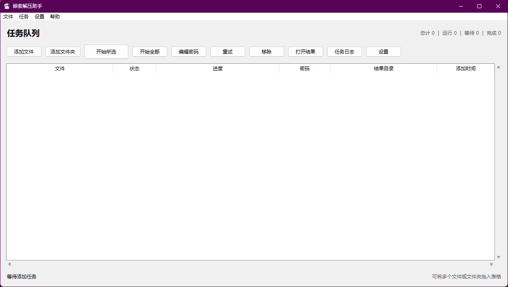
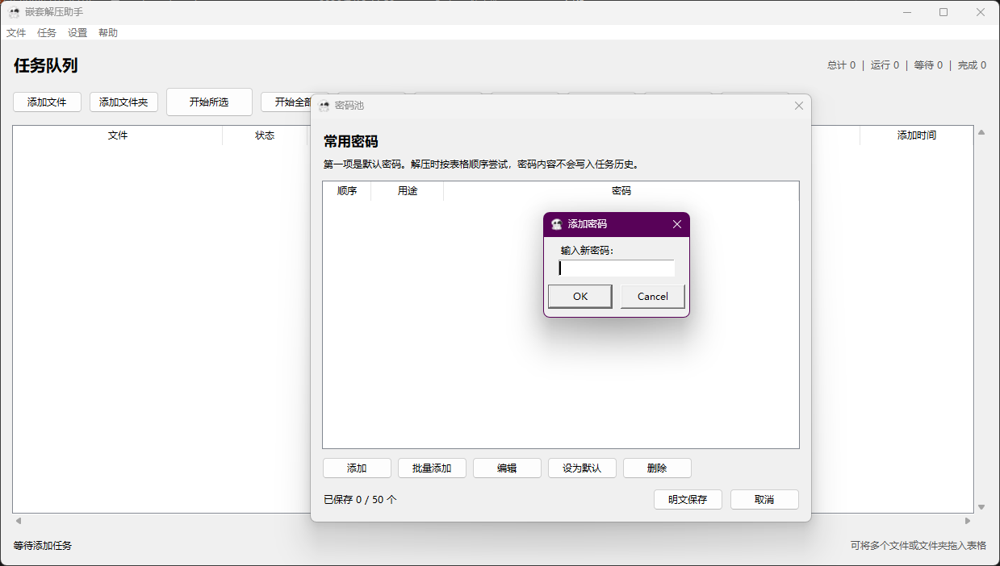
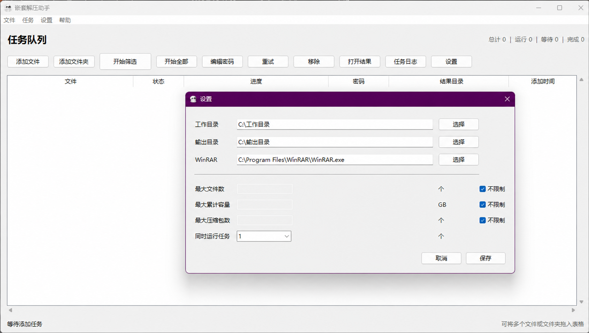

# Nested Extraction Assistant

[简体中文](README.md) | [English](README-英文.md)

A local archive extraction tool for Windows, designed for nested archives, incorrect file extensions, disguised files, and common split archives.

## Features

- Automatically detects and extracts multiple disguised archive formats;
- Processes nested archives and continues with archives found after extraction;
- Supports incorrect file extensions, embedded ZIP files, and Apate-compatible disguises;
- Supports common RAR, ZIP, and 7Z volumes, including sequentially numbered volumes;
- Allows a separate password for each task or ordered attempts from a saved password pool;
- Supports dragging files or folders into a task list with progress and history;
- Keeps source files unchanged and stores working files and final results in separate directories.

## Requirements

- 64-bit Windows 10 or Windows 11;
- WinRAR installed;
- The portable version does not require Python.

## Quick Start

1. Extract the complete ZIP package instead of copying only the EXE;
2. Run `嵌套解压助手.exe`;
3. Confirm the WinRAR path, working directory, and output directory in Settings;
4. Add or drag in files, provide a task password or password pool when needed, and start extraction.

The working directory and output directory must be separate and should not be placed inside the source directory.
